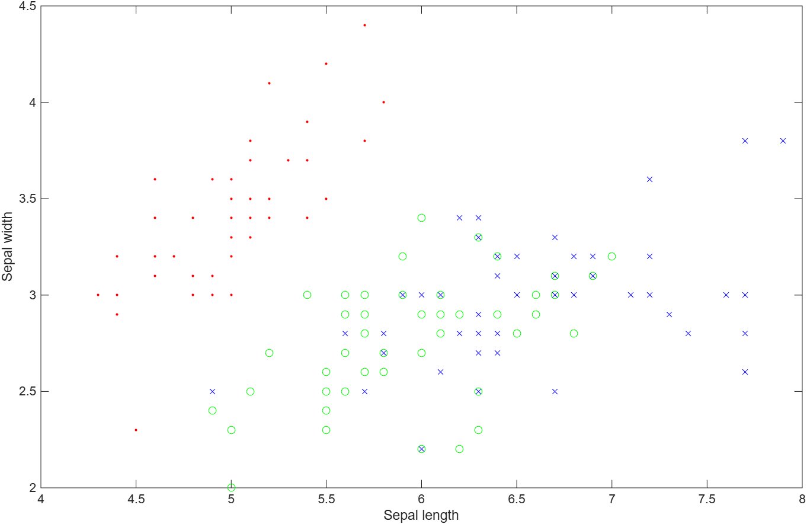
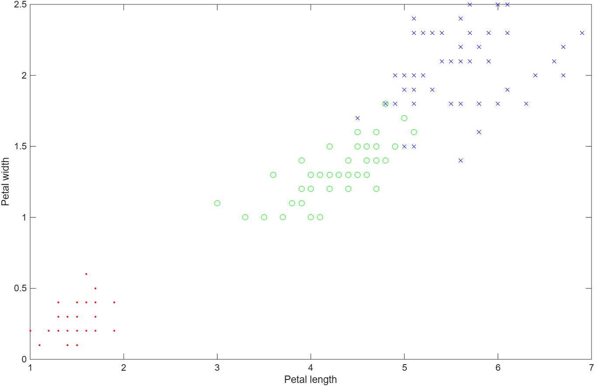
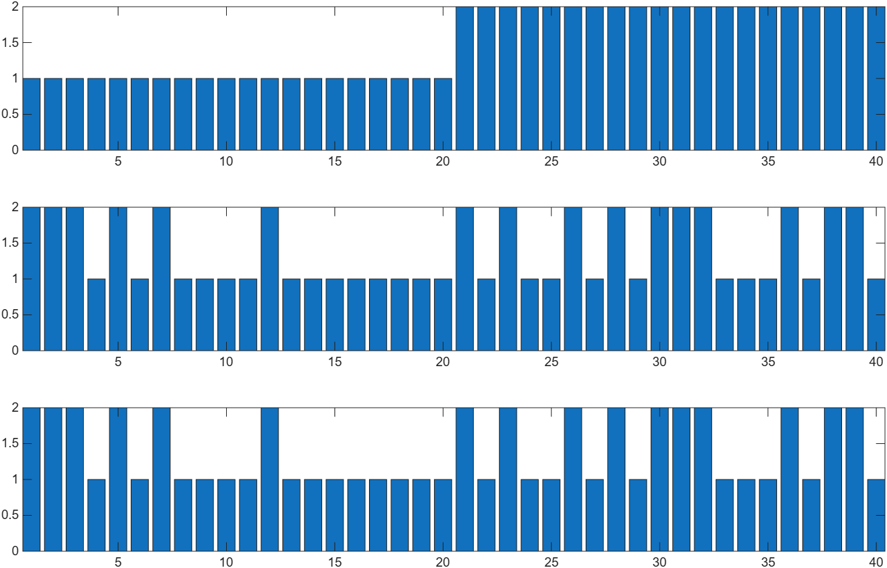
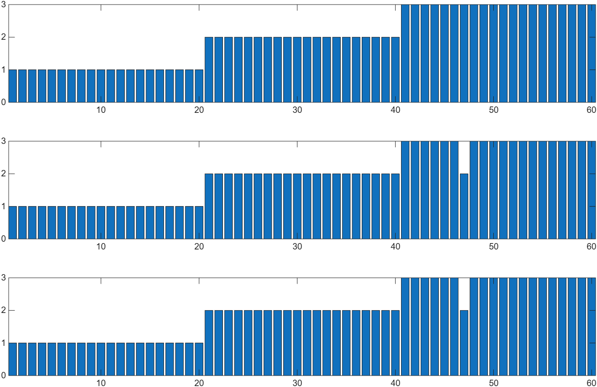
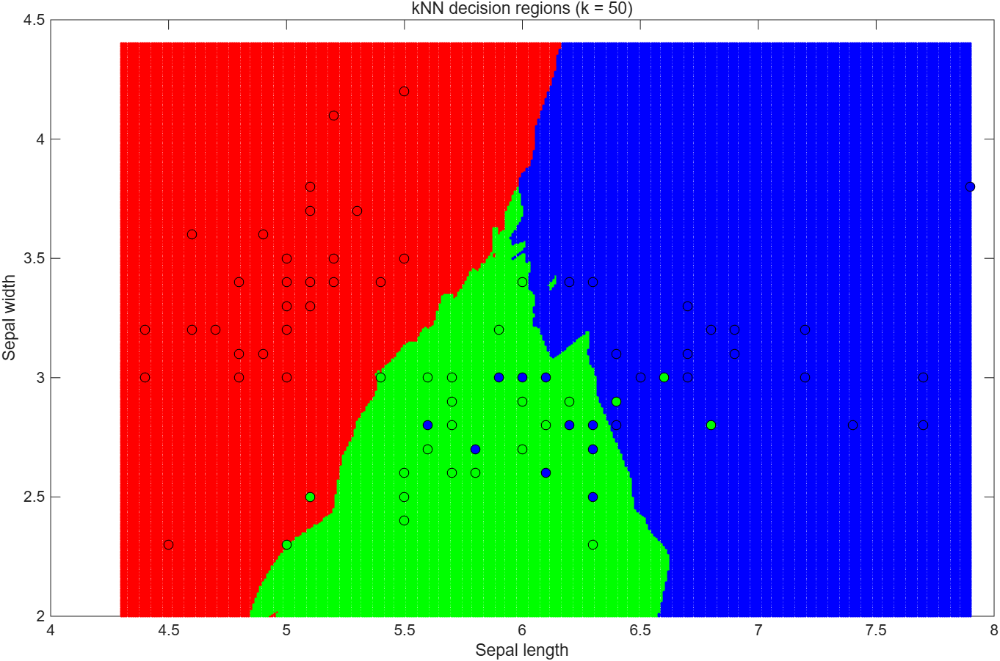

# 02. 유사성 기반 인공지능: k-Nearest Neighbors (kNN)

Iris(붓꽃) 데이터를 이용해 kNN 분류기를 **MATLAB 내장 함수**로 만들어 보고, 같은 것을 **직접 구현**해서 결과가 일치하는지 확인한 뒤, kNN이 만드는 **결정 영역**을 시각화합니다.

## 학습 목표

- 데이터를 불러와 특징(feature) 공간에 그려 보고, 종(class)별 분포를 눈으로 확인한다.
- 학습 데이터 / 평가 데이터를 나누는 이유와 방법을 이해한다.
- kNN 알고리즘(거리 계산 → k개 이웃 선택 → 다수결)을 직접 구현한다.
- 특징을 2개만 쓸 때와 4개 모두 쓸 때의 성능 차이를 비교한다.
- k 값에 따라 결정 영역이 어떻게 변하는지 관찰한다.

## 파일 설명

| 파일 | 내용 |
|------|------|
| `ex1_dataload_visualization.m` | `fisheriris` 데이터 로드, 종을 숫자(1/2/3)로 변환, sepal·petal 특징 산점도, 학습/평가 데이터 분할 |
| `ex2_knn_using_matlab.m` | `fitcknn` + `predict` 로 versicolor vs. virginica 2-클래스 분류 (특징: sepal length/width, k=3) |
| `ex3_knn_my_style.m` | 같은 문제를 반복문으로 직접 구현 (유클리드 거리 → `sort` → `mode`), `fitcknn` 결과와 일치 여부 확인 |
| `ex4_knn_generalization.m` | 특징 4개 · 3-클래스로 일반화 (k=5), 직접 구현 vs. `fitcknn` 비교 |
| `ex5_knn_space.m` | sepal 평면을 0.01 간격 격자로 채우고 각 점을 kNN(k=50)으로 분류해 결정 영역 시각화 |
| `save_fig.m` | 그림을 `figures/` 에 png 로 저장하는 도우미 함수 (R2020a 이상 `exportgraphics`, 구버전 `saveas`) |
| `run_all.m` | ex1 ~ ex5 를 순서대로 실행하고 그림을 모두 저장 |
| `figures/` | 실행 결과 그림 |

## 데이터 분할

Iris 데이터는 150개 (1\~50: setosa, 51\~100: versicolor, 101\~150: virginica). 실습 편의상 **인덱스 순서로** 나눴습니다.

| 실험 | 클래스 | 특징 | 학습 데이터 (인덱스) | 평가 데이터 (인덱스) |
|------|--------|------|----------------------|----------------------|
| ex2, ex3 | versicolor, virginica (2개) | sepal length, width (2개) | 71\~100, 121\~150 (60개) | 51\~70, 101\~120 (40개) |
| ex4 | setosa, versicolor, virginica (3개) | 4개 모두 | 21\~50, 71\~100, 121\~150 (90개) | 1\~20, 51\~70, 101\~120 (60개) |
| ex5 | 3개 | sepal length, width (2개) | 21\~50, 71\~100, 121\~150 (90개) | 격자점 약 13만 개 |

## 알고리즘 요약 (kNN)

평가 데이터 한 점 `x` 에 대해

1. 학습 데이터의 모든 점 `x_i` 와의 유클리드 거리 `d_i = sqrt(sum((x_i - x).^2))` 를 계산한다.
2. 거리를 오름차순 정렬해 가장 가까운 **k개**를 고른다.
3. 그 k개의 라벨 중 **최빈값(`mode`)** 을 `x` 의 예측 클래스로 정한다.

학습 단계에서 하는 일은 데이터를 저장하는 것뿐이고, 계산은 전부 예측 시점에 일어납니다 (lazy learning). 결정해야 할 것은 **k** 와 **거리 척도** 두 가지입니다.

## 실행 방법

```matlab
cd 02_knn_iris
run_all          % 전체 실행 (약 2분, ex5 가 대부분)
```
개별 스크립트도 그대로 실행할 수 있습니다. `ex5_knn_space.m` 은 격자점 약 13만 개 × 학습 데이터 90개를 반복문으로 계산하므로 30초~1분 정도 걸립니다.

## 결과

| 실험 | 특징 수 | 클래스 수 | k | 정확도 | 직접 구현 = `fitcknn`? |
|------|---------|-----------|---|--------|------------------------|
| ex2 / ex3 | 2 (sepal) | 2 | 3 | **60.0 %** (24/40) | 일치 (`isequal` = 1) |
| ex4 | 4 (전체) | 3 | 5 | **98.3 %** (59/60) | 일치 (`isequal` = 1) |

sepal 두 특징만으로는 versicolor 와 virginica 가 많이 겹쳐서 정확도가 낮고, petal 특징까지 4개를 모두 쓰면 거의 완벽하게 분류됩니다. (ex1 의 petal 산점도에서 이미 세 종이 잘 분리되는 것을 볼 수 있습니다.)

### ex1. 특징 공간 시각도

| Sepal length vs. width | Petal length vs. width |
|---|---|
|  |  |

빨강 `.` setosa, 초록 `o` versicolor, 파랑 `x` virginica

### ex3. 직접 구현한 kNN vs. MATLAB `fitcknn` (2-클래스, sepal 특징)



위: 정답 / 가운데: 직접 구현 / 아래: `fitcknn` — 가운데와 아래가 완전히 같음

### ex4. 특징 4개 · 3-클래스 (k=5)



### ex5. kNN 결정 영역 (sepal 평면, k=50)



배경색이 각 위치에서 kNN이 예측한 클래스, 동그라미가 학습 데이터입니다. k=50 처럼 k가 크면 경계가 부드러워지고, 소수 클래스 점들이 다른 색 영역에 묻히는 것을 볼 수 있습니다. (k를 1, 5, 15 등으로 바꿔 보면 경계가 훨씬 울퉁불퉁해집니다.)

